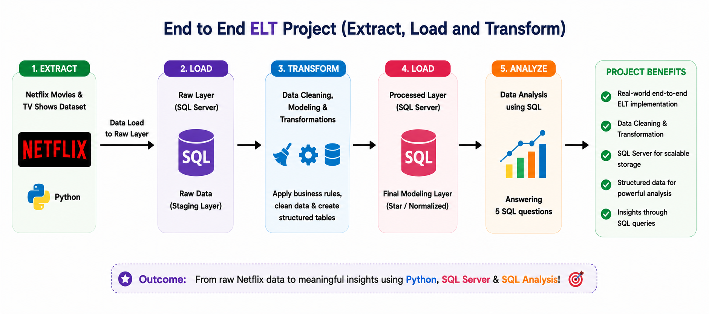

# End-to-End ELT Project (Extract, Load, Transform) — Netflix Dataset

An end-to-end **ELT (Extract, Load, Transform)** data engineering project that takes the raw Netflix Movies & TV Shows dataset, loads it into SQL Server, cleans and models it into structured tables, and answers real business questions using SQL.

## 🔄 Pipeline Overview

| Stage | What happens |
|-------|---------------|
| **1. Extract** | Read the Netflix Movies & TV Shows dataset (`netflix_titles.csv`) using **Python** (pandas). |
| **2. Load (Raw)** | Load the raw, unprocessed data as-is into a **staging table** (`netflix_raw`) in **SQL Server** using `sqlalchemy` / `pyodbc`. |
| **3. Transform** | Clean the data, handle duplicates and nulls, apply business rules, and split it into structured, normalized tables. |
| **4. Load (Processed)** | Load the cleaned, modeled data into the final processed layer in SQL Server. |
| **5. Analyze** | Run SQL queries against the processed layer to answer analytical questions. |

## 🗂️ Repository Contents

| File | Description |
|------|--------------|
| `netflix_titles.csv` | Raw source dataset (Netflix Movies & TV Shows). |
| `netflix_data_extract.ipynb` | Python notebook that extracts the CSV data and loads it into the `netflix_raw` staging table in SQL Server. |
| `SQLQuery2.sql` | DDL script that creates the `netflix_raw` staging table schema. |
| `netflix_data_analysis.sql` | SQL script for data cleaning, deduplication, transformation into modeled tables (`netflix`, `netflix_genre`, `netflix_country`, `netflix_directors`), and the final analysis queries. |

## 🛠️ Tech Stack

- **Python** (pandas, SQLAlchemy, pyodbc) — extraction and loading
- **SQL Server** — raw staging layer and processed/modeled layer
- **T-SQL** — data cleaning, transformation, and analysis

## 🚀 How It Works

### 1. Extract & Load Raw Data
`netflix_data_extract.ipynb` reads `netflix_titles.csv` with pandas and loads it into the `netflix_raw` table (schema defined in `SQLQuery2.sql`) using a SQLAlchemy connection to SQL Server.

### 2. Transform
`netflix_data_analysis.sql` performs:
- **Deduplication** of records using `ROW_NUMBER()` over `title` and `type`.
- **Null handling**, e.g. populating missing `country` values based on each director's most common country, and standardizing missing `duration`/rating values.
- **Splitting multi-valued columns** (`listed_in`, `director`, `country`, `cast`) into separate normalized tables using `STRING_SPLIT` and `CROSS APPLY`:
  - `netflix` — cleaned core show data
  - `netflix_genre` — one row per show/genre
  - `netflix_country` — one row per show/country
  - `netflix_directors` — one row per show/director

### 3. Analyze — 5 Business Questions
The processed layer answers the following with SQL:
1. For each director who has made both movies and TV shows, count how many of each they created.
2. Which country has produced the highest number of comedy movies.
3. For each year (by date added to Netflix), which director released the most movies.
4. The average movie duration for each genre.
5. Directors who have created both horror and comedy movies, with counts of each.

## 📊 Project Benefits

- ✅ Real-world end-to-end ELT implementation
- ✅ Data cleaning & transformation practice
- ✅ SQL Server used as a scalable storage layer
- ✅ Structured, modeled data ready for analysis
- ✅ Insights derived through pure SQL queries

## 🎯 Outcome

From raw Netflix data to meaningful insights — using **Python**, **SQL Server**, and **SQL Analysis**.

## 📋 Prerequisites

- SQL Server (with ODBC Driver 17 for SQL Server)
- Python 3.x with `pandas`, `sqlalchemy`, `pyodbc`

## ▶️ Getting Started

1. Set up a SQL Server instance and update the connection string in `netflix_data_extract.ipynb` to point to your server.
2. Run `SQLQuery2.sql` to create the `netflix_raw` staging table.
3. Run `netflix_data_extract.ipynb` to load `netflix_titles.csv` into `netflix_raw`.
4. Run the transformation queries in `netflix_data_analysis.sql` to clean the data and build the modeled tables (`netflix`, `netflix_genre`, `netflix_country`, `netflix_directors`).
5. Run the analysis queries at the bottom of `netflix_data_analysis.sql` to answer the 5 business questions.

## 📁 Dataset

The dataset used is the publicly available **Netflix Movies and TV Shows** dataset (`netflix_titles.csv`), containing details such as title, type, director, cast, country, date added, release year, rating, duration, genres, and description.
